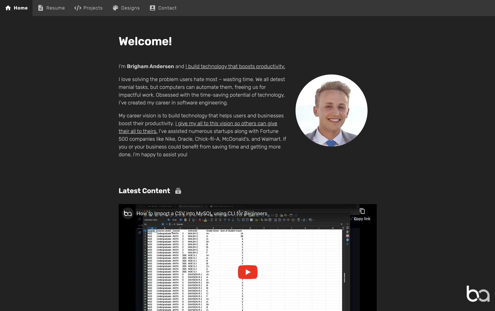

> The website adjusts between light and dark mode based on your device settings!

# Intro

Back when I was first starting in web development, my first job had us learning React. Since React was what I was first learning so I was most comfortable and skilled in it, I chose React as well when it came time to make my portfolio site. This was a useful learning experience, but over the years I've learned good use cases for single-page apps vs static sites, and for this portfolio, having it be a static HTML and CSS site makes a lot more sense. So in a strange cyclical fashion, I'm now going back to the basics with this site, building it with the same tools a beginner would. It's been a good reminder to me that your tech stack doesn't have to be complicated. Stick to the traditional tech when possible and only reach for new tools on a per-need basis.

One of the great benefits of this switch to a simple HTML site is performance! After switching away from React and then making some image optimizations and improving accessibility, the site quickly jumped up to 100% on lighthouse scores!

# Additional Information

### Icons

I opted to download icons as svgs then copy the svg code directly in (had to copy it directly in so that you can apply fill using css variables). This also helped to avoid downloading a bunch of unused icons.

[Home Icon](https://fonts.google.com/icons?selected=Material+Icons:home:&icon.query=home)

[Resume Icon](https://fonts.google.com/icons?selected=Material+Icons:description:&icon.query=description)

[Projects Icon](https://fontawesome.com/icons/code?f=classic&s=solid)

[Designs Icon](https://fonts.google.com/icons?selected=Material+Icons:color_lens:&icon.query=color+lens)

[Contact Icon](https://fonts.google.com/icons?selected=Material+Icons:account_box:&icon.query=account_box)

[Latest Content Icon](https://fonts.google.com/icons?selected=Material+Icons:subscriptions:&icon.query=subscriptions)

[LinkedIn Icon](https://fontawesome.com/icons/linkedin?f=brands&s=solid)

[Top Languages Icons and GitHub Icon](https://devicon.dev/)

[Vue Icon (Not from top languages site)](https://www.svgrepo.com/svg/327411/logo-vue)

[Mail Icon](https://fonts.google.com/icons?selected=Material+Icons:mail_outline:&icon.query=email&icon.set=Material+Icons)

[Phone Icon](https://fonts.google.com/icons?selected=Material+Icons:call:&icon.query=call&icon.set=Material+Icons)

[Download Icon](https://fonts.google.com/icons?selected=Material+Icons:download:&icon.query=download&icon.style=Filled)

### Shots of Websites I've Made

To optimize load times and consistency, I made them all square (800x800) and .webp format.

### Latest Content on YouTube

At one point I was putting in my latest content on YouTube, but embedding YouTube players really slowed down the site and it didn't feel as useful. I tried making them be clickable thumbnail links rather than players, but that was going to require a lot of extra manual effort every time to add each thumbnail.
With that in mind, I decided to just leave a link to my YouTube channel instead.

### FAQ: Why is this codebase in Vanilla HTML, CSS, and JS?

It's a matter of using the right tool for the job. It may not be the most cutting-edge tech stack, but all I need is a simple static site that shows text and images the same way every time, so using static HTML is a fine choice here.
For context, I've tried a number of other options. When I first made my portfolio, it was in HTML. Then when I learned React for my job, I wanted to practice it, so I converted my portfolio to React. However, over time I realized that a SPA was the wrong choice for my portfolio site that was not dynamic but entirely static. Having to load up React and all its packages was killing the initial page load times. So I went back to the basics with HTML and that's where I've stayed. And yes, I could use a static site generator like NextJS, Astro, or Gatsby, then have the nice benefits of React like reusable components and better paths without `.html` in them, but for me I'd rather just keep things simple while the website is simple. If the website becomes more complex, I might start to reach for a tool like that, but for now simpler is better.

### FAQ: Why did the Top Languages section get removed?

This was a pretty cool section where you could see my top languages and be able to click to be redirected to a search of my GitHub for instances where I had used the language. While this was cool and fun to make, I removed it for several reasons.

- It was redundant as that information was already on my resume, so removing it means that now I have one less thing to maintain.
- The GitHub repo search by language wasn't always incredible accurate as a lot of the experience I gain comes at work, but those repos cannot be public on my GitHub.
- The main value in this section was showing what languages and tech stacks I'm proficient in, but I'm instead conveying this on the projects page where I'll lay out the tech stacks there and on the README pages.
