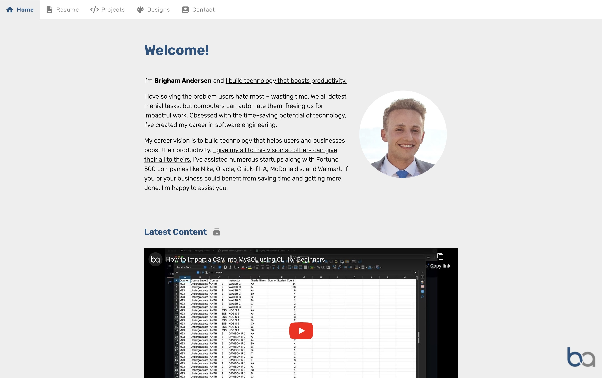

> The website adjusts between light and dark mode based on your device settings!

# Intro

Back when I was first starting in web development, my first job had us learning React. Since React was what I was first learning so I was most comfortable and skilled in it, I chose React as well when it came time to make my portfolio site. This was a useful learning experience, but over the years I've learned good use cases for single-page apps vs static sites, and for this portfolio, having it be a static HTML and CSS site makes a lot more sense. So in a strange cyclical fashion, I'm now going back to the basics with this site, building it with the same tools a beginner would. It's been a good reminder to me that your tech stack doesn't have to be complicated. Stick to the traditional tech when possible and only reach for new tools on a per-need basis.

# Additional Information

### Icons

I opted to download icons as svgs then copy the svg code directly in (had to copy it directly in so that you can apply fill using css variables). This also helped to avoid downloading a bunch of unused icons.

[Home Icon](https://fonts.google.com/icons?selected=Material+Icons:home:&icon.query=home)

[Resume Icon](https://fonts.google.com/icons?selected=Material+Icons:description:&icon.query=description)

[Projects Icon](https://fontawesome.com/icons/code?f=classic&s=solid)

[Designs Icon](https://fonts.google.com/icons?selected=Material+Icons:color_lens:&icon.query=color+lens)

[Contact Icon](https://fonts.google.com/icons?selected=Material+Icons:account_box:&icon.query=account_box)

[Latest Content Icon](https://fonts.google.com/icons?selected=Material+Icons:subscriptions:&icon.query=subscriptions)

[LinkedIn Icon](https://fontawesome.com/icons/linkedin?f=brands&s=solid)

[Top Languages Icons and GitHub Icon](https://devicon.dev/)

[Vue Icon (Not from top languages site)](https://www.svgrepo.com/svg/327411/logo-vue)

[Mail Icon](https://fonts.google.com/icons?selected=Material+Icons:mail_outline:&icon.query=email&icon.set=Material+Icons)

[Phone Icon](https://fonts.google.com/icons?selected=Material+Icons:call:&icon.query=call&icon.set=Material+Icons)

[Download Icon](https://fonts.google.com/icons?selected=Material+Icons:download:&icon.query=download&icon.style=Filled)

### Shots of Websites I've Made

To optimize load times and consistency, I made them all square (800x800) and .webp format.

### Adding videos to Latest Content

Paste in this code and fill in the video id:

```
<iframe
  src="https://www.youtube.com/embed/<youtube-video-id>?controls=0&modestbranding=1"
></iframe>
```

Then take a screenshot of the result, compress as webp and display that as an `` inside an `<a>` tag.
The reason we do this is because doing normal YouTube embed is really slow, and when you navigate back it has to reload. We don't even need an inline player, just something that looks like the youtube video that when clicked takes you to the link.
